# 🧠 Recursive Thinking From Within: How Transformers Learn Algorithms Through Latent Space Reasoning

## TL;DR ✨
Can transformers truly learn algorithms, or do they merely memorize patterns? We show that standard transformers fail to generalize beyond their training distribution on algorithmic tasks. However, by introducing four key mechanisms—**recurrence**, **algorithmic supervision**, **discrete latent spaces**, and **error correction**—we enable transformers to develop genuine algorithmic reasoning that generalizes to problems **4× larger** than those seen during training. Through detailed mechanistic analysis, we reveal exactly how transformer components orchestrate to solve modular arithmetic problems algorithmically. 🔍

---

## 🎯 Motivation: Do Language Models Truly Reason?

The reasoning capabilities of **Large Language Models (LLMs)** have advanced dramatically in recent years, particularly through **Chain-of-Thought (CoT)** techniques that enable models to generate step-by-step reasoning traces. These advances have led to impressive performance on mathematical reasoning benchmarks like GSM8K and MATH, with models now solving complex problems that once seemed beyond reach.

But beneath this impressive performance lies a fundamental question:

> **💭 The Central Question**: Do LLMs truly learn to **implement algorithms** and **reason systematically**, or do they simply **memorize patterns** that happen to work within their training distribution?

Recent evidence suggests LLMs may not truly reason but instead perform sophisticated pattern matching. Studies show that reasoning models exhibit counterintuitive scaling limits, with performance collapsing on high-complexity tasks regardless of size ([Mirzadeh et al., 2025](https://arxiv.org/abs/2506.06941)). This raises the question: **Can Transformers learn to implement genuine algorithms that generalize systematically?**

---

## 🧪 Our Testbed: Modular Arithmetic on Computation Graphs

### The Task Definition

**Problem:** Evaluate arithmetic expressions on **directed acyclic graphs (DAGs)** under modular arithmetic (modulo 23).

- **Input:** A computation graph where:
  - **Leaf nodes** are assigned integer values
  - **Internal nodes** are computed via arithmetic operations on their dependencies
  - All operations ($+, -, \times $) performed modulo 23

- **Output:** Compute the values of all nodes in the graph


### A Concrete Example

Consider this computation graph with 9 nodes:

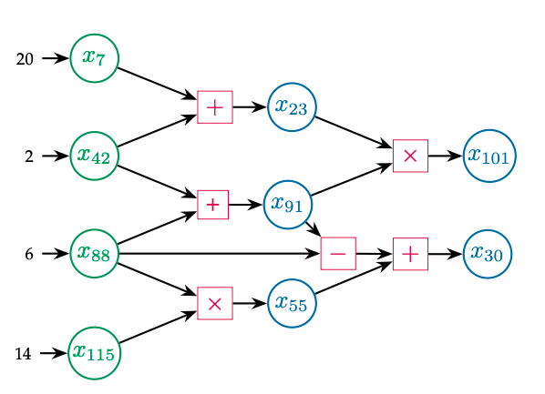
*The computation graph structure: **Green nodes** ($x_7, x_{42}, x_{88}, x_{115}$) are leaf nodes with given values (depth 0). **Pink boxes** represent arithmetic operations ($+, \times, -$). **Blue nodes** ($x_{23}, x_{91}, x_{55}, x_{101}, x_{30}$) must be computed from their dependencies.*

<div style="background-color: rgba(33, 150, 243, 0.15); padding: 15px; margin: 20px auto; border-radius: 8px; border: 2px solid #2196F3; max-width: 800px; text-align: center;">

**📝 The Task:** Given $x_7=20$, $x_{42}=2$, $x_{88} = 6$, $x_{115} =14$, compute $x_{23}$, $x_{91}$, $x_{55}$, $x_{101}$, and $x_{30}$

</div> 

### The Natural Algorithm

To solve this problem, a natural algorithmic approach is to **compute nodes layer-by-layer in topological order**:

**Iteration 1 (Depth 1)** - Compute nodes that depend only on leaf values:
- $x_{23} = x_7 + x_{42} = 20 + 2 = 22 \pmod{23}$
- $x_{91} = x_{42} + x_{88} = 2 + 6 = 8 \pmod{23}$
- $x_{55} = x_{88} \times x_{115} = 6 \times 14 = 15 \pmod{23}$

**Iteration 2 (Depth 2)** - Compute nodes that depend on depth ≤ 1:
- $x_{101} = x_{23} \times x_{91} = 22 \times 8 = 15 \pmod{23}$
- $x_{30} = x_{91} - x_{88} + x_{55} = 8 - 6 + 15 = 17 \pmod{23}$

<div style="background-color: rgba(255, 152, 0, 0.1); padding: 15px; border-left: 5px solid #FF9800; margin: 20px 0; border-radius: 4px;">

**🎯 Key Property: Size-Independent Algorithm**

The **complexity** of each problem is parameterized by graph size $N$ and depth $D$. However, the **algorithm itself is independent of size**—it is always the same layer-by-layer procedure!

**The Critical Test for Algorithmic Learning:**
- If a model learns this **algorithm**, it should work on graphs of any size
- If it memorizes **patterns**, performance will collapse on larger graphs

This makes it an ideal testbed for studying whether Transformers can learn genuine algorithms.

</div>

### Input Representation

The computation graph is presented to the model as a **token sequence**.

**Token Vocabulary:**
- **Values**: `0`, `1`, ..., `22` (mod 23)
- **Variables**: `x_0`, `x_1`, ..., `x_127`
- **Operations**: `+`, `-`, `×`
- **Special tokens**: `→` (assignment), `[sep]` (separator)

**Example Token Sequence for the graph above:**
$$
\begin{aligned}
&\langle 20 \rangle \langle \to \rangle \langle x_7 \rangle \langle \text{sep} \rangle
 \langle 2 \rangle \langle \to \rangle \langle x_{42} \rangle \langle \text{sep} \rangle
 \langle 6 \rangle \langle \to \rangle \langle x_{88} \rangle \langle \text{sep} \rangle
 \langle 14 \rangle \langle \to \rangle \langle x_{115} \rangle \langle \text{sep} \rangle \\
&\langle x_7 \rangle \langle + \rangle \langle x_{42} \rangle \langle \to \rangle \langle x_{23} \rangle \langle \text{sep} \rangle
 \langle x_{42} \rangle \langle + \rangle \langle x_{88} \rangle \langle \to \rangle \langle x_{91} \rangle \langle \text{sep} \rangle \\
&\langle x_{88} \rangle \langle \times \rangle \langle x_{115} \rangle \langle \to \rangle \langle x_{55} \rangle \langle \text{sep} \rangle
 \langle x_{23} \rangle \langle \times \rangle \langle x_{91} \rangle \langle \to \rangle \langle x_{101} \rangle \langle \text{sep} \rangle \\
&\langle x_{91} \rangle \langle - \rangle \langle x_{88} \rangle \langle + \rangle \langle x_{55} \rangle \langle \to \rangle \langle x_{30} \rangle
\end{aligned}
$$

This sequence serves as the **input prompt** to the model.

### Why This is an Ideal Testbed for Algorithmic Generalization

This task possesses three key properties that make it perfect for testing whether models learn genuine algorithms:

1. **📏 Complexity is Parameterized by Graph Size**: Problem complexity is directly controlled by the number of nodes $N$ and depth $D$ in the graph.

2. **🔄 Algorithm is Size-Independent**: The layer-by-layer algorithm that solves the problem is **identical regardless of graph size**—only the number of iterations scales with $D$. This is the hallmark of a true algorithm!

3. **🎯 Captures Real Mathematical Reasoning**: This task mirrors the structure of established mathematical reasoning benchmarks like GSM8K, where multi-step arithmetic must be performed in dependency order.

**The Critical Test**: If a model learns the **algorithm** (layer-by-layer traversal), it should work on graphs of any size. If it memorizes **distribution-specific patterns**, performance will collapse on larger graphs.

---


## 📊 Experimental Setup & Baseline Methods

### Training and Testing Data

**Training:** Models are trained on randomly generated computation graphs with:
- **Graph Size**: $N \leq 32$ nodes (varying within this range)
- **Operations**: Addition ($+$), subtraction ($-$), multiplication ($\times$) modulo 23
- **Diversity**: Diverse graph topologies and depths

**Out-of-Distribution Testing:** To assess algorithmic generalization, we evaluate on **much larger graphs**. We evaluate on graphs with various sizes and the largest size has **$N = 128$** (4× training size).

These test graphs require **significantly more computational steps** than anything seen during training.

### Baseline Methods

To establish the limitations of current approaches, we evaluate two standard training paradigms:

#### 1. **End-to-End Training**

Standard transformer models trained to directly output all node values given the input, without explicit intermediate steps.

- **Input:** Token sequence representing the graph (as shown above)
- **Output:** Direct prediction of all node values
- **Architectures tested:** Both feedforward and recurrent transformers

#### 2. **Chain-of-Thought (CoT) Training**

The prevalent technique for multi-step reasoning in LLMs. Instead of directly outputting the answer, CoT trains the model to generate intermediate reasoning steps.

- **Input:** Graph token sequence + special `[CoT]` token
- **Output:** Step-by-step computation in topological order

**Example CoT output for computing $x_{101}$:**
$$
[\text{...Input Prompt...}] \langle \text{CoT} \rangle [\text{...}] \langle x_{101} \rangle = \langle x_{23} \rangle \langle \times \rangle \langle x_{91} \rangle = \langle 22 \rangle \langle \times \rangle \langle 8 \rangle = \langle 15 \rangle
$$

Here, `[...]` denotes the preceding CoT trajectory that computed $x_{23}$ and $x_{91}$.

**Implementation:** For all methods, we conduct extensive hyperparameter search (layers, model dimension, positional encoding) and select the best-performing configuration.

### Observed OOD Generalization Deficiencies

<div style="background-color: rgba(239, 83, 80, 0.1); padding: 15px; border-left: 5px solid #EF5350; margin: 20px 0; border-radius: 4px;">

**🔴 Key Findings: Catastrophic Failure Beyond Training Distribution**

- **End-to-End models** (both feedforward and recurrent): Fail to effectively learn the task even in-distribution, with performance rapidly degrading as graph size increases.

- **Chain-of-Thought** enables significant improvement, achieving near-perfect in-distribution performance ($N \leq 32$). However, it exhibits only **limited OOD generalization** to moderately larger graphs ($N \approx 40$), and this capability **rapidly deteriorates** as graph sizes exceed the training regime.

- At $N=128$ (4× training size):
  - **End-to-End**: ~10% accuracy
  - **Chain-of-Thought**: ~25% accuracy

**Key Takeaway:** Even CoT—with its explicit step-by-step supervision—learns distribution-specific shortcuts rather than a generalizable algorithm. The token-based, linear reasoning format proves brittle and fails to scale.

</div>

**This motivates the need for alternative architectural mechanisms that enable genuine algorithmic learning.**

### 🚀 Our Solution: Four Architectural Mechanisms

Effective OOD generalization requires learning a scalable **algorithm**—one that can be executed iteratively and adapts to input complexity. We identify four key mechanisms:

<div style="background-color: rgba(33, 150, 243, 0.1); padding: 20px; border-left: 5px solid #2196F3; margin: 20px 0; border-radius: 4px;">

**Core Principle: Depth-Invariant Latent Space Reasoning**

Rather than forcing computation into a token-by-token format (like CoT), we enable **native latent-space reasoning** through:

1. **🔄 Recurrence & Adaptive Computation** - Scale computation time with problem complexity
2. **🎯 Algorithmic Supervision** - Guide learning toward the correct layer-by-layer procedure via latent space supervision
3. **🎲 Discrete Latent Anchoring** - Prevent representational drift across iterations
4. **🔧 Self-Correction** - Detect and recover from intermediate errors

These mechanisms impose a **depth-invariant structure**: the computation at each recurrent step is identical, enabling robust scaling far beyond training depth.

</div>

---

## 🚀 Four Mechanisms for Algorithmic Generalization

We identify four key architectural mechanisms that enable transformers to develop true algorithmic reasoning:

<table style="width:100%; border: none;">
  <tr>
    <td style="width:25%; text-align:center; border: none; vertical-align: top;">
      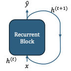
      <br/>
      <div style="height: 40px; display: flex; align-items: center; justify-content: center;">
        <b>🔄 Recurrence &<br/>Adaptive Computation</b>
      </div>
    </td>
    <td style="width:25%; text-align:center; border: none; vertical-align: top;">
      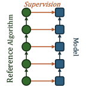
      <br/>
      <div style="height: 40px; display: flex; align-items: center; justify-content: center;">
        <b>🎯 Algorithmic<br/>Supervision</b>
      </div>
    </td>
    <td style="width:25%; text-align:center; border: none; vertical-align: top;">
      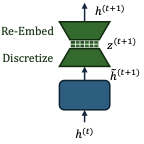
      <br/>
      <div style="height: 40px; display: flex; align-items: center; justify-content: center;">
        <b>🎲 Anchored Discrete<br/>Latent Space</b>
      </div>
    </td>
    <td style="width:25%; text-align:center; border: none; vertical-align: top;">
      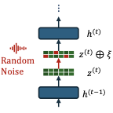
      <br/>
      <div style="height: 40px; display: flex; align-items: center; justify-content: center;">
        <b>🔧 Error<br/>Correction</b>
      </div>
    </td>
  </tr>
</table>

*Figure: Four architectural mechanisms enabling algorithmic generalization. (1) **Recurrence** allows adaptive computation depth matching problem complexity; (2) **Algorithmic Supervision** guides learning toward the correct layer-by-layer algorithm via latent space supervision; (3) **Discretization** creates stable checkpoints preventing representational drift across iterations; (4) **Error Correction** enables the model to detect and fix its own mistakes during iterative reasoning.*

---

### Implementation of Proposed Mechanisms

To evaluate the effectiveness of each mechanism, we study multiple model configurations implementing different subsets of these components:

| **Method** | **Mechanism 1<br/>Recurrence** | **Mechanism 2<br/>Supervision** | **Mechanism 3<br/>Discretization** | **Mechanism 4<br/>Error Correction** |
|------------|:------:|:------:|:------:|:------:|
| End-to-End Feedforward | ✗ | ✗ | ✗ | ✗ |
| Recurrent End-to-End | ◐ | ✗ | ✗ | ✗ |
| Chain-of-Thought | ◐ | ◐ | ✗ | ✗ |
| Continuous Latent Space Supervision | ✓ | ✓ | ✗ | ✗ |
| Discrete Latent Space Supervision | ✓ | ✓ | ✓ | ✗ |
| **Discrete Latent Space Supervision ↻** | ✓ | ✓ | ✓ | ✓ |

*Table: ✓ = fully implemented, ◐ = partially implemented, ✗ = not implemented*

---

### Detailed Mechanism Descriptions

<div style="background-color: rgba(255, 152, 0, 0.12); padding: 15px; border-left: 5px solid #FF9800; margin: 20px 0; border-radius: 4px;">

### **🔄 Mechanism 1: Recurrence & Input-Adaptive Computation**

**Motivation**: Systematic generalization to more complex problem instances requires the ability to scale computation time proportionate to input complexity, beyond the training regime.

**Implementation**: We employ a recurrent Transformer block that iteratively processes the input:

$$
(E_1^{(t+1)}, \ldots, E_n^{(t+1)}) \gets \mathrm{RecurrentTransformerBlock}(E_1^{(t)}, \ldots, E_n^{(t)}), \quad t = 1, 2, \ldots, T
$$

**Crucially**, the number of recurrent iterations $T$ is **not fixed**—it **adapts to the input**. Specifically, $T$ scales linearly with the depth $D$ of the computation graph. For a graph with depth $D=2$, we use $T=2$ iterations; for $D=10$, we use $T=10$ iterations. This input-adaptive recurrence enables dynamic scaling of computation time to match problem complexity.

**Key Advantage**: Unlike CoT methods that scale computation by generating progressively longer token sequences, recurrence introduces inductive biases favoring recursive solution structures that are inherently more scalable.

</div>

<div style="background-color: rgba(76, 175, 80, 0.12); padding: 15px; border-left: 5px solid #4CAF50; margin: 20px 0; border-radius: 4px;">

### **🎯 Mechanism 2: Latent State Algorithmic Supervision**

**Motivation**: While recurrence provides capacity for iterative computation, it does not inherently guarantee that the model learns the desired layer-by-layer algorithmic procedure.

**Implementation**: We provide supervision directly within the model's latent representation space at each recurrent step. At iteration $t$, a shared linear readout layer predicts node values from latent embeddings $E_i^{(t)}$. The training loss is:

$$
\text{AlgorithmAlignmentLoss} = \sum_{t=1}^{T} \sum_{i} \underbrace{\mathbb{1}[\text{Depth}(x_i) \leq t]}_{\text{only supervise nodes computable by iteration } t} \cdot \ell(W_{\text{value}} \cdot E_i^{(t)}, \text{Value}(x_i))
$$

**Intuition**: At iteration $t$, the layer-by-layer algorithm should have computed all nodes at depth $\leq t$. The indicator $\mathbb{1}[\text{Depth}(x_i) \leq t]$ ensures we only supervise those nodes—if $\text{Depth}(x_i) \leq t$, the value should already be known by iteration $t$, so we train the embedding $E_i^{(t)}$ to correctly predict $\text{Value} (x_i)$.

**Example**: In the graph from Figure 1:
- At $t=1$: Supervise leaf nodes ($x_7, x_{42}, x_{88}, x_{115}$)
- At $t=2$: Supervise depth-1 nodes ($x_{23}, x_{91}, x_{55}$) *plus* leaves
- At $t=3$: Supervise depth-2 nodes ($x_{101}, x_{30}$) *plus* all previous

**Key Distinction**: Unlike CoT which supervises in token space, this supervises directly in latent states, steering internal representations to align with the algorithm's step-by-step execution.

</div>

<div style="background-color: rgba(3, 169, 244, 0.12); padding: 15px; border-left: 5px solid #03A9F4; margin: 20px 0; border-radius: 4px;">

### **🎲 Mechanism 3: Anchoring Latent Representations via Discretization**

**Motivation**: Recurrent models can suffer from representational drift during extended out-of-distribution computation. When processing significantly more iterations than seen during training, continuous representations gradually deviate from the learned manifold, causing performance degradation.

**Implementation**: We introduce a discretization mechanism that anchors the model's latent representations. After each recurrent iteration, continuous hidden states are projected into a structured discrete symbolic space with factored components (token syntax, variable identity, operation type, numerical value). These discrete states are then re-embedded to form input for the next iteration.

**The Discrete Space Structure** — consider the token sequence $17 = x_{42}$ `[sep]`:

| Token | → | syntax | variable | operation | value |
|:-----:|:-:|:------:|:--------:|:---------:|:-----:|
| `17` | → | `value` | `N/A` | `N/A` | `17` |
| `=` | → | `=` | `N/A` | `N/A` | `N/A` |
| $x_{42}$ | → | `variable` | $x_{42}$ | `N/A` | `empty` |
| `[sep]` | → | `[sep]` | `N/A` | `N/A` | `N/A` |

Note that the `value` factor of variable tokens (e.g., `x₄₂`) is `empty` initially. As the model processes recurrently, it iteratively computes values and updates this factor.

**Effect**: This discrete bottleneck ensures each iteration operates on representations from a shared, anchored space, preventing drift and enabling stable processing across many iterations.

</div>

<div style="background-color: rgba(233, 30, 99, 0.12); padding: 15px; border-left: 5px solid #E91E63; margin: 20px 0; border-radius: 4px;">

### **🔧 Mechanism 4: Learning to Self-Correct**

**Motivation**: In sequential reasoning, errors at any step can propagate and compromise the entire solution. As problem complexity scales, the likelihood of encountering errors increases, limiting the ability to generalize to more complex instances.

**Implementation**: We train the model to detect and correct errors by stochastically corrupting the model's discrete latent states during training. At each recurrent iteration, with small probability, we randomly corrupt value components (e.g., changing a computed value from 15 to 8). This forces the model to learn to:
1. **Detect** when previously-computed values are incorrect (due to corruption or its own mistakes)
2. **Correct** errors in subsequent steps before proceeding with dependent computations

**Empirical Finding**: The model achieves nearly **100% one-step error correction rate**. Notably, effective error correction requires **deeper models** (more layers per recurrent block), as the model must simultaneously identify errors, correct them, and perform the current step's computation.

</div>

---

##  📊 Experimental Results

### Enabling Robust Algorithmic OOD Generalization

Combining these mechanisms yields dramatic improvement in out-of-distribution performance:

<div style="display: flex; gap: 20px; align-items: flex-start; margin: 20px 0;">
  <div style="flex: 1;">
    <p align="center">
      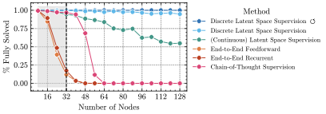
    </p>
    <p style="text-align: center; font-size: 0.9em; margin-top: 10px;">
      <strong>Figure (a):</strong> OOD generalization across methods. Our full method (red) achieves near-perfect performance even at 4× training size.
    </p>
  </div>
  <div style="flex: 1;">
    <p align="center">
      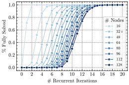
    </p>
    <p style="text-align: center; font-size: 0.9em; margin-top: 10px;">
      <strong>Figure (b):</strong> Effective OOD generalization via input-adaptive scaling of computation time (Discrete Latent Space Supervision ↻).
    </p>
  </div>
</div>

**Result**: Combining all four mechanisms, our full method (**Discrete Latent Space Supervision ↻**) achieves **near-perfect performance** even on graphs 4× larger than training, with accuracy remaining above **99.5%** at $N=128$.

### Ablation Analysis: Understanding Each Mechanism's Contribution

Figure (a) above shows a systematic ablation study. By comparing methods that differ in which mechanisms they implement (see the earlier table), we can isolate each mechanism's contribution:

**Key Findings from Pairwise Comparisons:**

- **Recurrence matters**: Comparing *End-to-End Feedforward* vs *End-to-End Recurrent* shows that recurrence enables better in-distribution learning, but alone is insufficient for OOD generalization.

- **Algorithmic supervision is critical**: *Chain-of-Thought* (partial supervision in token space) achieves limited OOD generalization to $N \approx 40$. *Continuous Latent Space Supervision* (full latent supervision) extends this significantly further.

- **Discretization prevents drift**: *Continuous Latent Space Supervision* shows gradual performance degradation on larger graphs. Adding discretization (*Discrete Latent Space Supervision*) dramatically improves robustness, maintaining high accuracy even at $N=128$.

- **Error correction adds robustness**: The full method with self-correction (*Discrete Latent Space Supervision ↻*) achieves the most robust performance, approaching perfect accuracy across all test sizes.

**The Synergy Effect**: Each mechanism addresses a distinct failure mode. Together, they create a robust algorithmic learner with performance exceeding the sum of individual contributions.

---

## 🔬 Mechanistic Interpretability: How Does It Actually Work?

One of the most exciting aspects of our work is that we don't just show *that* it works—we explain *how* it works! Through detailed analysis, we reverse-engineer the exact algorithm the model learned.

> **🎯 Central Questions:**
> 1. What algorithm does the trained model implement?
> 2. Why can it generalize to OOD data?

### Technical Overview: Analysis Methodology

We employ a systematic approach to analyze each model component (first-layer attention, second-layer attention, final MLP):

**1. Relative Variance Analysis** — Identifying attention head specialization

For each attention head, we measure how changes to specific input variables affect the attention weights. By computing the relative variance of attention patterns when perturbing different variables, we identify which heads specialize in tracking which variable positions ($\mathtt{var}_0$, $\mathtt{var}_1$, $\mathtt{var}_2$, or $\mathtt{rhs}$).

**2. Norm Amplification Analysis** — Understanding information flow

Our discrete latent space has factored components (syntax, variable, operation, value). To understand which information types each attention head copies, we analyze the combined value-output (OV) projection matrix. For each factored embedding type, we measure the operator norm of the subspace projection:

$$
\text{Amplification}_{\text{factor}} = \|P_{\text{factor}} \cdot W_O W_V \cdot P_{\text{factor}}\|_{\text{op}}
$$

where $P_{\text{factor}}$ projects onto the embedding subspace for that factor. High amplification indicates that information type is being copied.

**3. Frequency Domain Analysis** — Decoding arithmetic operations

To understand how the MLP performs modular addition, we use 3D Discrete Fourier Transform (DFT) analysis. By varying all three input values and computing the DFT of internal representations, we identify which frequency components are amplified—revealing the MLP's use of periodic functions for modular arithmetic.

**4. Controlled Perturbation Experiments** — Validating hypotheses

We form hypotheses about each component's role, then design controlled experiments that modify specific input elements and trace how these modifications affect internal representations and final outputs.

### 🎯 The Discovered Algorithm: An Induction Head Mechanism

Here's what we found—the model implements a beautiful **induction head** mechanism! Let's break it down step-by-step:

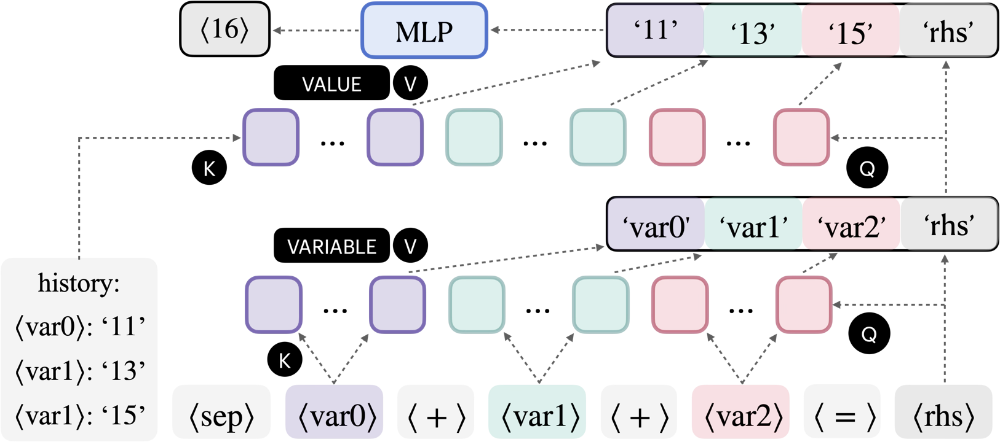
*The complete computational circuit showing how each layer contributes! 🎨*

<div style="background-color: rgba(156, 39, 176, 0.1); padding: 15px; border-left: 5px solid #9C27B0; margin: 20px 0; border-radius: 4px;">

### **🔍 Layer 1 Attention: Variable Identification**

**What It Does**: The first layer's attention heads organize into distinct groups, each specialized for tracking specific variable positions in equations.

**The Grouping Pattern**:
- **Heads $\{4, 8\}$**: Track the first variable ($\mathtt{var}_0$) 🎯
- **Heads $\{5, 12\}$**: Track the second variable ($\mathtt{var}_1$) 🎯
- **Heads $\{3, 7, 11, 14\}$**: Track the third variable ($\mathtt{var}_2$) 🎯

**Crucial Detail**: These heads copy variable *identities* (not values!) to the position where computation occurs. They're saying: "Remember that we need to look up $x_7$, $x_{42}$, and $x_{88}$"

</div>

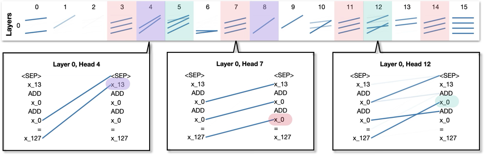
*First-layer attention heads organize into groups based on which variable position they track. This figure shows the grouping structure discovered through relative variance analysis.*

**Relative Variance Analysis Results** — Each heatmap below shows which attention heads respond strongly when perturbing a specific variable position:

<table style="width:100%; border: none;">
  <tr>
    <td style="width:25%; text-align:center; border: none; vertical-align: top;">
      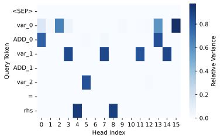
      <br/>
      <b><code>var₀</code> (Heads 4, 8)</b>
    </td>
    <td style="width:25%; text-align:center; border: none; vertical-align: top;">
      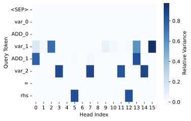
      <br/>
      <b><code>var₁</code> (Heads 5, 12)</b>
    </td>
    <td style="width:25%; text-align:center; border: none; vertical-align: top;">
      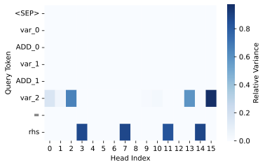
      <br/>
      <b><code>var₂</code> (Heads 3, 7, 11, 14)</b>
    </td>
    <td style="width:25%; text-align:center; border: none; vertical-align: top;">
      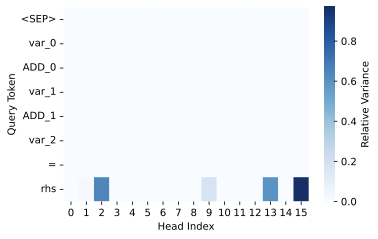
      <br/>
      <b><code>rhs</code> (result position)</b>
    </td>
  </tr>
</table>

*Reading the heatmaps: Each row represents an attention head (0-15), and red indicates high relative variance. When we perturb $\mathtt{var}_0$, heads 4 and 8 show strong response (left heatmap). Similarly, each `variable` position has its dedicated head group. Crucially, look at the $\mathtt{rhs}$ heatmap (rightmost): heads from all groups show activation, because the $\mathtt{rhs}$ position needs information from all `variable`s.*

**Norm Amplification Analysis** — What type of information do these heads copy?

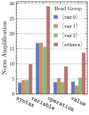

Operator norm amplification for different factored embedding types across all 16 attention heads. The `variable` factor (orange) shows dramatically higher amplification than other factors, confirming that first-layer attention heads copy **`variable` identities** (not `value`s!) to the $\mathtt{rhs}$ position.

<div style="clear: both;"></div>

<div style="background-color: rgba(76, 175, 80, 0.1); padding: 15px; border-left: 5px solid #4CAF50; margin: 20px 0; border-radius: 4px;">

### **🎯 Layer 1 MLP: Minimal Processing**

**What We Found**: The first MLP makes only minor adjustments to the residual stream (relative $L_2$ error $< 10\%$)!

**Why This Matters**: This efficient division of labor focuses computational capacity where it's needed most—primarily in attention for information routing and the final MLP for arithmetic computation.

</div>

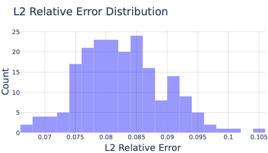
*Layer 1 MLP contributes minimally—most work happens in attention and the final MLP! 📉*

<div style="background-color: rgba(3, 169, 244, 0.1); padding: 15px; border-left: 5px solid #03A9F4; margin: 20px 0; border-radius: 4px;">

### **🔄 Layer 2 Attention: Value Retrieval (The Induction Head!)**

**What It Does**: Now that we know *which* variables we need, the second layer's attention heads retrieve their *values*!

**The Induction Head Mechanism**:
1. Use the variable names copied by Layer 1 as **queries**
2. Search through previous equations to find where each variable was first computed
3. Copy the *value* embeddings from those positions

**Head Grouping Pattern**:
- **Heads $\{0, 8, 15\}$**: Retrieve value of $\mathtt{var}_0$ 🎯
- **Heads $\{5, 10\}$**: Retrieve value of $\mathtt{var}_1$ 🎯
- **Heads $\{2, 3, 4, 7, 9\}$**: Retrieve value of $\mathtt{var}_2$ 🎯

**Why "Induction"?**: This mirrors the classic "induction head" pattern discovered in language models—using context from earlier in the sequence to copy relevant information forward!

</div>

**Attention Head Statistics** — Quantifying head specialization through relative variance analysis

<div style="display: flex; gap: 20px; margin: 20px 0; align-items: flex-start;">
  <div style="flex: 1;">
    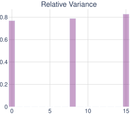
    <p style="text-align: center; margin-top: 8px;"><b><code>var₀</code> relative variance</b></p>
  </div>
  <div style="flex: 1;">
    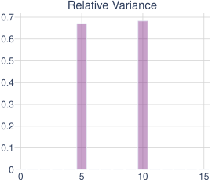
    <p style="text-align: center; margin-top: 8px;"><b><code>var₁</code> relative variance</b></p>
  </div>
  <div style="flex: 1;">
    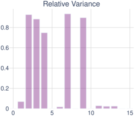
    <p style="text-align: center; margin-top: 8px;"><b><code>var₂</code> relative variance</b></p>
  </div>
</div>

*Each subfigure shows the relative variance histogram for each attention head. High relative variance for specific heads indicates specialization. For example, heads 0, 8, and 15 show high relative variance for $\mathtt{var}_0$, confirming they specialize in retrieving that `variable`'s `value`.*

**Norm Amplification Analysis** — What type of information is copied?

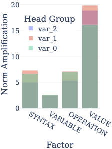

Operator norm amplification for Layer 2 heads. Unlike Layer 1 (which amplified `variable` embeddings), Layer 2 heads strongly amplify the `value` factor, confirming they copy **numerical `value`s** (not `variable` names) from previous equations. This reveals the head specialization: different heads focus on retrieving `value`s for different `variable` positions.

<div style="clear: both;"></div>
 
<div style="background-color: rgba(255, 152, 0, 0.1); padding: 15px; border-left: 5px solid #FF9800; margin: 20px 0; border-radius: 4px;">

### **🎵 Layer 2 MLP: Modular Addition in Frequency Domain (The Magic!)**

**The Setup**: By this point, the MLP receives the sum of three transformed value embeddings—one for each variable. Now it needs to compute (x + y + z) mod 23.

**The Discovery**: The MLP performs modular arithmetic using a **frequency-based mechanism**! 🌊

**How It Works** (this is fascinating!):

Through 3D Fourier analysis, we observe:

1. **Input Stage**: Dominated by a bias term $(0,0,0)$ frequency 📍
2. **Processing**: Bias diminishes, diagonal frequencies $(a,a,a)$ amplify 📈
3. **Output**: Strong components of form $\cos(2\pi a(x+y+z)/23)$ and $\sin(2\pi a(x+y+z)/23)$ ✨

**Why This Is Clever**: The diagonal frequencies $(a,a,a)$ naturally encode the sum $x+y+z$. For example, consider the cosine terms:
$$
\cos(2\pi a \cdot x/23) \cdot \cos(2\pi a \cdot y/23) \cdot \cos(2\pi a \cdot z/23)
$$
contains terms with $\cos(2\pi a(x+y+z)/23)$ (via trigonometric product identities). Similar patterns hold for sine functions.

The periodic nature of trigonometric functions **automatically handles** the modulo-23 arithmetic! No explicit mod operation needed—it emerges naturally from the periodic structure. The MLP learns to represent values using combinations of these sine and cosine bases. 🎯

</div>

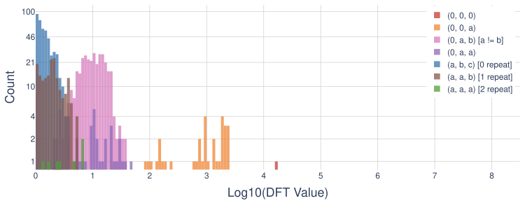
*Before MLP: Dominated by bias term (0,0,0 frequency)*

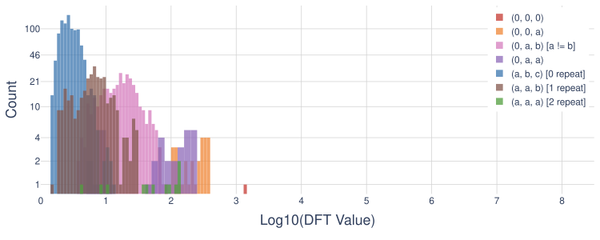
*During MLP: Bias decreases, diagonal frequencies increase! 🌊*

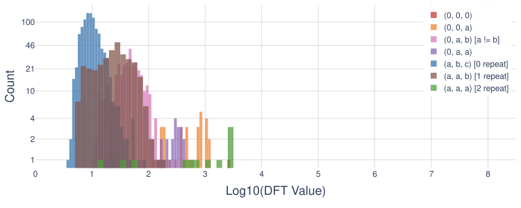
*After MLP: Strong diagonal components encoding the sum! The frequency (a,a,a) represents $\cos(2\pi a(\mathtt{var}_0+\mathtt{var}_1+\mathtt{var}_2)/23)$ 🎵*

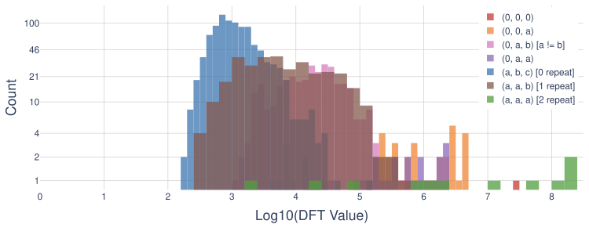
*Final output maintains the frequency structure for decoding! 🎯*

**Interpreting the Frequency Analysis:** The progression through these figures reveals the MLP's computational strategy. At the output layer (third figure), we observe strong magnitudes for diagonal frequency components $(a,a,a)$ where $a \in \{1, \ldots, 22\}$. These diagonal frequencies are crucial because they encode the sum: a component with frequency $(a,a,a)$ corresponds to trigonometric functions of $\mathtt{var}_0 + \mathtt{var}_1 + \mathtt{var}_2$. The MLP essentially transforms the input into this frequency-based representation, where the final answer can be directly decoded from these sum-encoding components. This elegant mechanism allows modular arithmetic to emerge naturally from the periodic structure of sine and cosine functions.

---

### 🎬 The Complete Algorithm: A Step-by-Step Walkthrough

Let's trace through how the model solves a concrete example to see everything working together:

**Given:** $x_7 = 15$, $x_{42} = 8$

**Solve:** $x_{23} = x_7 + x_{42} = \, ?$

<div style="background-color: rgba(156, 39, 176, 0.1); padding: 15px; border-radius: 4px; margin: 20px 0;">

**🎯 Step 1 - First Attention Layer (Variable Identification)**
- Head group $\{4, 8\}$ identifies $x_7$ is in position $\text{VAR}_0$
- Head group $\{5, 12\}$ identifies $x_{42}$ is in position $\text{VAR}_1$
- These heads copy the variable *names* (not values!) to the RHS position
- **Output**: "We need to compute something involving $x_7$ and $x_{42}$"

**🔄 Step 2 - First MLP (Minor Adjustments)**
- Makes minor adjustments ($< 10\%$ change to residual stream)
- Primarily normalization, no major computation
- **Output**: Slightly refined representation

**🔍 Step 3 - Second Attention Layer (Value Retrieval via Induction)**
- Head group $\{0, 8, 15\}$ searches for where $x_7$ was computed
- Finds "$x_7 = 15$" in a previous equation
- Copies the value embedding for $15$
- Similarly, head group $\{5, 10\}$ retrieves value $8$ for $x_{42}$
- **Output**: The RHS position now has embeddings representing values $15$ and $8$

**✨ Step 4 - Second MLP (The Magic Happens Here!)**
- **Input**: Sum of transformed embeddings for $15$ and $8$
- **Internal computation**:
  - Represents values as combinations of sin/cos bases
  - Amplifies frequencies encoding $(15 + 8) = 23$
  - The periodic structure naturally handles modulo: $23 \bmod 23 = 0$
- **Output**: Representation of $0$ (since $23 \bmod 23 = 0$) ✅

**🔄 Step 5 - Recurrence (For Deeper Dependencies)**
- If more equations depend on $x_{23}$, the process repeats!
- Each iteration handles one "layer" of dependencies
- The discrete bottleneck ensures clean state for next iteration 🎯

</div>

---

## 🎓 Conclusion

Our work demonstrates that transformers can learn genuine algorithms that generalize far beyond their training distribution—but only with the right architectural mechanisms. By combining four key ingredients (**recurrence**, **latent space supervision**, **discretization**, and **self-correction**), we enable transformers to develop recursive reasoning that mirrors the structure of the underlying algorithm.

The mechanistic analysis reveals an elegant computational structure:
- **Layer 1 attention** identifies which variables are needed
- **Layer 2 attention** retrieves their values via an induction head mechanism
- **Final MLP** performs modular arithmetic using frequency-domain processing
- **Recurrence** enables input-adaptive computation that scales to arbitrary problem sizes

This modular, interpretable solution emerges naturally from training with our architectural constraints. The combination of strong performance (generalizing from N≤32 to N=128) and mechanistic understanding suggests a path toward more capable and trustworthy AI systems: rather than hoping models will spontaneously develop algorithmic reasoning, we can architect them with the right inductive biases to ensure they learn robust, generalizable algorithms.

---

### Citation

```bibtex
@article{altabaa2024recursive,
  title={Recursive Thinking From Within: Unlocking Out-of-Distribution Generalization
         in Transformers via Latent Space Reasoning},
  author={Altabaa, Awni and Chen, Siyu and Lafferty, John and Yang, Zhuoran},
  journal={arXiv preprint},
  year={2024}
}
```